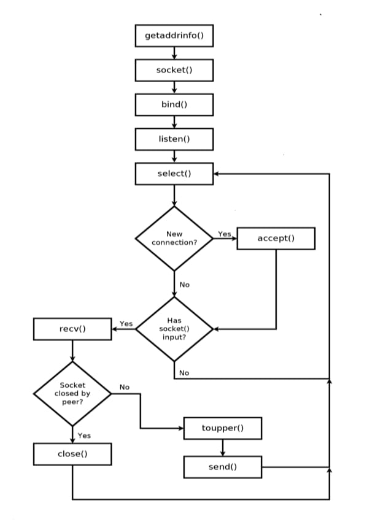

**Note: The lines of code in this documentation is not mine, it has been reproduced following the book "Hands On Network Programming in C" by Lewis Van Wrikle which you can fork/copy from [Hand_On_Network_Programming_with_C](https://github.com/PacktPublishing/Hands-On-Network-Programming-with-C). Here would be a simple explanation, on what I learned following this book. Enjoy :)**

In the previous blog series, we answered what TCP was, and how TCP  was used to transport data from one point of communication to another over the internet. Previously we used a remote server to exchange data between nodes, while here we aim at using a local one, essentially, we're building our own little corner of the internet.(Sounds fancy, it is)

## Getting Started: The Concept of a Server

The concept of a server, like any other computer, said simply is nothing fancy. It is, in the end, `just a pile of sand that was somehow made to give us physical detachment from reality`. But let's dig deeper into what makes this pile of sand special.

`A server is a computer that provides information to other computers called "clients" on a computer network` - Wikipedia. 

The server is an actor of what is known as the client-server architecture. In Figure 3 is a brief description of how conceptually we can think of the client and server relationship.


*Note: This is my own drawing, however you are free to adjust it to your likings*

From one part of the schema, you have my computer (FLokshi's thinkpad :)) which in this scenario is the client. Now, let me be clear: my computer is not actually the client,it's the hardware part. What is the real client is, for example, your web browser. Say Chrome, which I use.
*I would use Firefox, but can't because my memory crashes just by the thought of it. If you know, you know. But pro tip: use Firefox in the winter,the amount of RAM it consumes is going to warm you continuously, better than any space heater.*

From the other side you have the server. The idea is quite simple: I open my web client (Chrome) and write the following URL to the search bar: `https://flokshi.github.io/flokshi` and hit enter. 

**What just happened behind the scenes?**

1. My client (Chrome) resolved the domain name `flokshi.github.io` to an IP address using DNS (Domain Name System) *Irrelevant to the idea, but it is really interesting how in 2008, a DNS flaw was discovered by Dan Kaminsky, which could potentially break the whole internet Suggest reading it just for fun :|* 
2. My computer established a TCP connection to the server (A three-way handshake)
3. Chrome sent an HTTP GET request for the resource `/flokshi` from the host `flokshi.github.io`
4. The server processed this request and prepared a response

To demonstrate this, we made a request to the site from a Chrome browser (doesn't really matter which browser) and intercepted the traffic using Burp Suite. The whole request header is displayed in Figure 3.


*Note: Screenshot taken by me*

The request made was a GET request, meaning that we are telling the server: "Hey buddy, I want to GET the following resource from you, please and thank you." What the server gives to us is the response, and the response (res for short) can be part of a group of categories called response status codes. 

**Common Response Status Codes:**
- **2xx (Success)**: Everything went well, here's your data.
- **3xx (Redirection)**: The resource moved, go look over there.
- **4xx (Client Error)**: You messed up, buddy (404 Not Found, 403 Forbidden, etc.)
- **5xx (Server Error)**: I (the server) messed up, sorry about that. 

Have fun exploring them: [response status code](https://developer.mozilla.org/en-US/docs/Web/HTTP/Reference/Status)

If the response is of the 200 code class, meaning that everything went well with our request, the server sends back the file we are looking for. In our case, it would be the HTML, CSS, and JavaScript that make up my beautiful and amaizing website.


## Getting Our Hands Dirty

I will start with the following image:


*Note: The image is not mine. It was reproduced from the user @PR0GRAMMERHUM0R on X. ALL the rights reserved to the original author*

So yeah, as the picture suggests, the nerds on the internet replaced a well-fine designed architecture as monolithic (such as the Linux Kernel) with microservices. 

But yeah, since 2014, and because of massive adoption from companies such as Google, Amazon, Netflix, etc., microservices have become quite popular. 

**The idea of microservices** is that large programming problems can be split up into many small subsystems that communicate over a network. Instead of having one massive program that does everything (monolithic), you have many small programs that each do one thing well and talk to each other. - Lewis Van Wrikle

**Advantages of microservices:**
- Each service can be developed, deployed, and scaled independently
- If one service crashes, the others keep running
- Different teams can work on different services without stepping on each other's toes
- You can use different programming languages for different services (use the right tool for the job)

**Disadvantages:**
- Network communication adds latency and complexity
- Debugging becomes harder (was it service A, B, C, or the network between them?)
- You need proper infrastructure to manage all these services

### Our Simple Microservice: The String Capitalizer

How does this help us? Well, the example taken in the book emphasizes the problem of creating a server which we are going to use to transform our string to uppercase, something like `aaa -> AAA`. This is a quite simple approach, but good to understand the fundamentals.

**Why create a separate service for this?**

One approach is to code this uppercase conversion directly inside our program. But here's the thing: what if we want to reuse this functionality in multiple programs? What if we want to update the logic without recompiling everything? What if we want this service to handle thousands of requests per second from multiple clients?

Alternatively, you could keep your program simple and instead connect to a service which is going to format the string for you. If the client connects to our server and sends `hello` → the server will respond back with `HELLO` all capitalized.

This will serve as a very basic microservice. For our microservice to be useful, it does need to handle many simultaneous incoming connections. For this reason, as the author mentioned in the book, we are going to again be using `select()` to handle those connections efficiently without creating a thread for each connection (because threads are expensive, and we're indeed to poor to afford RAM :( ).

### The Server Flow

The flow of how our program is going to work is shown in the picture below:



*Note: The image is being reproduced from the book Hands-on-network-programming-with-C by Lewis Van Wrikle. All rights reserved to the author*

The image above is pretty much as standard as the one that we used to create the TCP client, but with some key differences:

1. **Get local address** - We need to know where we're listening
2. **Create socket** - Our communication endpoint
3. **Bind socket to local address** - "This port belongs to me now"
4. **Listen for incoming connections** - "I'm ready to accept clients"
5. **Use select() to handle connections** - Monitor multiple sockets efficiently
6. **Accept new connections** - When select() tells us a new client wants to connect
7. **Read/Write data** - Handle requests from connected clients

Notice how we use `select()` to handle incoming connections rather than using `accept()` immediately. We first use `select()` to monitor which sockets are ready for I/O, and only when it's a new connection do we accept it by using `accept()`.
Without `select()`, we would either:
- Block on `accept()` waiting for new connections (can't handle existing clients)
- Block on `recv()` waiting for data from a client (can't accept new connections)

With `select()`, we can monitor all sockets at once and handle whichever is ready first. It's like having multiple eyes watching multiple doors simultaneously.

(*Note: Please refer to `man` for more information regarding the different between them. Be sure to always use `man`, its quite helpful*)

## The Code Breakdown

The code for the server is quite straightforward. Let's break it down step by step:

### Headers and Setup

```c
#include "chap03.h"
#include <ctype.h>
```

We start by including "chap03.h" header file (or whatever you've renamed it to), and also including the `<ctype.h>` header file. 

Based on Google: `ctype.h` (or `<cctype>` in C++) is a C standard library header providing functions to classify and transform single characters. It's incredibly useful for checking if a character is a digit, letter, whitespace, or converting it between uppercase and lowercase. This improves code readability and portability by abstracting ASCII value checks.
This library is what we're going to use to provide our microservice functionality.

### Configuring the Local Address

```c
struct addrinfo hints;
memset(&hints, 0, sizeof(hints));
hints.ai_family = AF_INET;        // IPv4
hints.ai_socktype = SOCK_STREAM;  // TCP
hints.ai_flags = AI_PASSIVE;      // Accept connections on any interface

struct addrinfo *bind_address;
getaddrinfo(0, "8080", &hints, &bind_address);
```

We handle the creation of the Windows socket (if we operate on Windows) and then we configure our local address. Pretty standard stuff, the same as what we used when we made the TCP client, but with crucial differences:

1. `hints.ai_family = AF_INET` - We specify IPv4 (not IPv6). Read `man getaddrinfo` for more information on address families.

2. `hints.ai_socktype = SOCK_STREAM` - We want the type of our socket to be TCP. This ensures reliable, ordered, connection-oriented communication, and make our server be the TCP server we need. 

3. `hints.ai_flags = AI_PASSIVE` - This is the key difference from the client. According to man page:
   > "If the AI_PASSIVE flag is specified in hints.ai_flags, and node is NULL, then the returned socket address will be suitable for binding a socket that will accept connections."
   
   In short: the socket that is going to be returned to us will be able to use `bind()` and `accept()`.

**The difference between client and server socket creation:**

When we were working with `tcp_client`, we didn't really set anything regarding the flags (we only set the connection type to `SOCK_STREAM`). According to man:
> "If the AI_PASSIVE flag is not set in hints.ai_flags, then the returned socket addresses will be suitable for use with connect(), sendto(), or sendmsg()."

And indeed:
- **TCP Client**: Wants a remote connection  uses `connect()`
- **TCP Server**: Wants a local binding  uses `bind()` and `accept()`

*To be honest, while I was reading about the tcp_client, I couldn't really pinpoint why we weren't using bind(), but then the book and Google explained it. The client doesn't need to bind because the OS automatically assigns it an ephemeral port when it calls connect().The server needs bind() because it must listen on a specific, well-known port that clients know about.*

### Creating and Binding the Socket

```c
SOCKET socket_listen = socket(bind_address->ai_family,
                               bind_address->ai_socktype,
                               bind_address->ai_protocol);

if (!ISVALIDSOCKET(socket_listen)) {
    fprintf(stderr, "socket() failed. (%d)\n", GETSOCKETERRNO());
    return 1;
}

if (bind(socket_listen, bind_address->ai_addr, bind_address->ai_addrlen)) {
    fprintf(stderr, "bind() failed. (%d)\n", GETSOCKETERRNO());
    return 1;
}
freeaddrinfo(bind_address);
```

After configuring the local address, we create our socket, pretty standard. Then, in the same way that we used `connect()` in the client, we use `bind()` to bind the socket to a local address.

Based on man:
> "When a socket is created with socket(), it exists in a name space (address family), but has no address assigned to it. bind() assigns the address specified by addr to the socket referred to by the file descriptor sockfd (or in our case, socket_listen). Traditionally, this operation is called 'assigning a name to a socket'."

**Function signature:**
```c
int bind(int sockfd, const struct sockaddr *addr, socklen_t addrlen)
```
On success: zero is returned. On error: -1 is returned and `errno` is set to indicate the error

Think of `bind()` like reserving a specific table at a restaurant. You're telling the OS: "This port is mine, send all traffic to this port to me."
(Note: The OS is just wonderful, isn't it)

### Setting Up to Listen

```c
if (listen(socket_listen, 10) < 0) {
    fprintf(stderr, "listen() failed. (%d)\n", GETSOCKETERRNO());
    return 1;
}
```

Only when we have successfully bound our socket to a local address do we move on to listening for connections.

**What does listen() do?**
The `listen()` function marks the socket as a passive socket, one that will be used to accept incoming connection requests using `accept()`.

The second parameter (10 in our case) is the **backlog**, it defines the maximum length to which the queue of pending connections may grow. If a connection request arrives when the queue is full, the client may receive an error like `ECONNREFUSED`.

**Think of the backlog like this:**
Imagine you're at a popular restaurant. The backlog is like the waiting area. If 10 people can wait and an 11th person shows up, they might be told "sorry, we're full, try again later." In network terms, their connection attempt gets refused.

### The File Descriptor Set

```c
fd_set master;
FD_ZERO(&master);
FD_SET(socket_listen, &master);
SOCKET max_socket = socket_listen;
```

All the connection file descriptors are going to be stored inside an `fd_set` named `master`, in which, after we zero it out, we're going to put all of our active sockets. We also keep a `max_socket`, which is initially going to be set to our listening socket's file descriptor.

`fd_set` is a data structure that represents a set of file descriptors. Think of it as a bit array where each bit represents whether a file descriptor is included in the set or not.

The `select()` function needs to know the highest-numbered file descriptor to check. We keep track of this so we don't waste time checking file descriptors that don't exist.

### The Main Loop

```c
printf("Waiting for connections...\n");

while(1) {
    fd_set reads;
    reads = master;
    
    if (select(max_socket+1, &reads, 0, 0, 0) < 0) {
        fprintf(stderr, "select() failed. (%d)\n", GETSOCKETERRNO());
        return 1;
    }
    
}
```

We then print a status message `printf("Waiting for connections...\n")`, enter the main loop, and wait for connections. The loop is obviously going to be looping forever, until either of the peers close the connection or you hit Ctrl+C (which sends SIGINT to our process, but that's a topic for another blog).

We copy the master content into another `fd_set` called `reads`. This is crucial. As explained in the book, if we use `select()` directly on `master`, we're going to modify its values. 

`select()` modifies the fd_set you pass to it, clearing out all the file descriptors that are NOT ready and leaving only the ones that ARE ready. So if we passed `master` directly, we'd lose track of all our sockets! By copying `master` to `reads` first, we preserve ourlist of all connected sockets.

```c
int select(int nfds, fd_set *readfds, fd_set *writefds, 
           fd_set *exceptfds, struct timeval *timeout)
```

- `nfds` - The highest-numbered file descriptor + 1
- `readfds` - File descriptors to check for reading
- `writefds` - File descriptors to check for writing (we pass 0/NULL)
- `exceptfds` - File descriptors to check for exceptions (we pass 0/NULL)
- `timeout` - How long to wait (we pass 0/NULL for infinite wait)

### Processing Ready Sockets

```c
SOCKET i;
for(i = 1; i <= max_socket; ++i) {
    if (FD_ISSET(i, &reads)) {
    }
}
```
We now loop through each possible socket and see whether it was flagged by `select()` as being ready. If the socket `i` was flagged by select, then `FD_ISSET(i, &reads)` is true. (This `isset` reminds me of the function in PHP—pretty nice consistency across languages!)

**Something to remember** as mentioned in the book: `FD_ISSET()` is only true for sockets that are ready to be read. 


### Accepting New Connections

```c
if (i == socket_listen) {
    struct sockaddr_storage client_address;
    socklen_t client_len = sizeof(client_address);
    
    SOCKET socket_client = accept(socket_listen,
                                   (struct sockaddr*) &client_address,
                                   &client_len);
    
    if (!ISVALIDSOCKET(socket_client)) {
        fprintf(stderr, "accept() failed. (%d)\n", GETSOCKETERRNO());
        return 1;
    }
    
    FD_SET(socket_client, &master);
    if (socket_client > max_socket)
        max_socket = socket_client;
    
    char address_buffer[100];
    getnameinfo((struct sockaddr*)&client_address,
                client_len,
                address_buffer, sizeof(address_buffer), 0, 0,
                NI_NUMERICHOST);
    printf("New connection from %s\n", address_buffer);
}
```

If the ready socket is `socket_listen`, then we `accept()` the connection. This is like opening the door when someone knocks.

**What happens during accept()?**
1. A new socket is created for the client connection
2. The client's address information is filled into `client_address`
3. The new socket is returned (or INVALID_SOCKET on error)

The original `socket_listen` continues listening for new connections. The new `socket_client` is used for communication with this specific client. This is how we can handle multiple clients simultaneously—each gets their own socket!

**After accepting, we must:**
1. Add the new client socket to the `master` set with `FD_SET()`
2. Update `max_socket` if this new socket has a higher file descriptor number
3. Optionally, log the client's address using `getnameinfo()`

`This function converts a socket address to a human-readable string. We pass `NI_NUMERICHOST` flag to get the IP address as a number (like "192.168.1.100") rather than attempting a reverse DNS lookup (which could block and is slower).`

### Handling Client Data

```c
else {
    char read[1024];
    int bytes_received = recv(i, read, 1024, 0);
    
    if (bytes_received < 1) {
        FD_CLR(i, &master);
        CLOSESOCKET(i);
        continue;
    }
    
    int j;
    for (j = 0; j < bytes_received; ++j)
        read[j] = toupper(read[j]);
    
    send(i, read, bytes_received, 0);
}
```

If the socket is NOT `socket_listen`, then it's a request from an already established client connection. In this case, we need to:
We create a buffer of 1024 bytes and receive data into it.

If `recv()` returns a value less than 1, it means:
   - 0: The client has performed an orderly shutdown
   - -1: An error occurred


**Process the data**: This is where our microservice magic happens! We loop through each received byte and convert it to uppercase using `toupper()` from `ctype.h`.

   ```c
   for (j = 0; j < bytes_received; ++j)
       read[j] = toupper(read[j]);
   ```

We use `send()` to transmit the uppercased data back to the client. Notice we send exactly `bytes_received` bytes, not 1024. We only send the data we actually received.

The `toupper()` function works on individual characters. If you pass it a lowercase letter ('a'-'z'), it returns the uppercase equivalent ('A'-'Z'). If you pass it anything else (numbers, uppercase letters, symbols), it returns the character unchanged. Perfect :)

**Flow example:**
```
Client sends: "hello world 123"
Server receives: "hello world 123"
Server processes: 'h'→'H', 'e'→'E', 'l'→'L', 'l'→'L', 'o'→'O', ' '→' ', ...
Server sends: "HELLO WORLD 123"
```

### Cleanup

```c
printf("Closing listening socket...\n");
CLOSESOCKET(socket_listen);

#if defined(_WIN32)
    WSACleanup();
#endif

printf("Finished.\n");
return 0;
```

When the server finally exits (which in our infinite loop would only happen with Ctrl+C, unless we add signal handling), we clean up resources:

Close the listening socket. On Windows, call `WSACleanup()` to release Windows socket resources. Print a friendly goodbye message

## Testing the Server

To test this server, you can:

**Compile and run the server:**
   ```bash
   gcc -o tcp_server tcp_server.c
   ./tcp_server
   ```

**Connect with telnet from another terminal:**
   ```bash
   telnet localhost 8080
   ```

**Type something and press Enter:**
   ```
   hello world
   ```

**See the response:**
   ```
   HELLO WORLD
   ```

**Connect multiple clients simultaneously** to see `select()` in action!

**Enjoy**.


### Note

So as you have come so far, I will assume that you liked the explanation :). I suggest to read the book. Is quite nice. (Together with the CISCO Networking Handbook and Internet), we will be unstopable. 

`Flokshi :)`

---

*Next up: We'll explore how to make our server handle even more connections using modern async I/O techniques, or maybe we'll build a simple HTTP server. Who knows? Future me will decide.If I do not become lazy*
